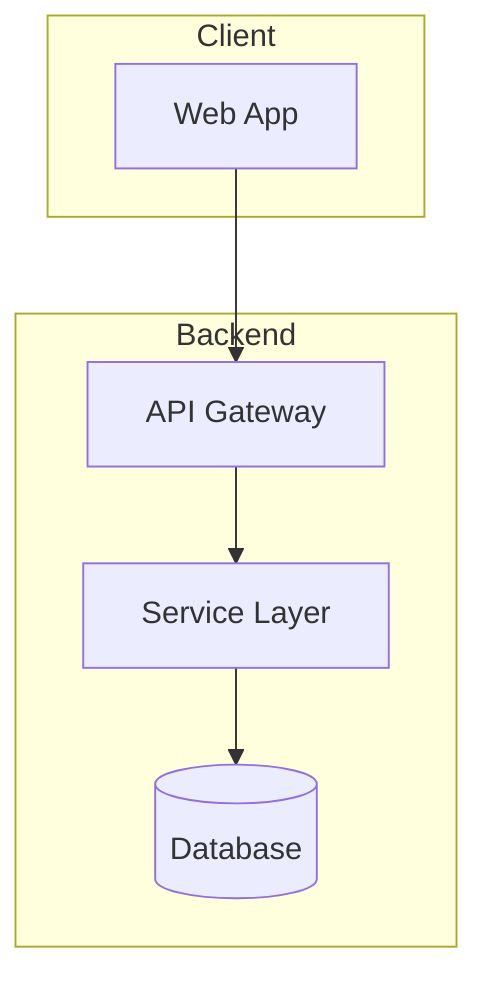
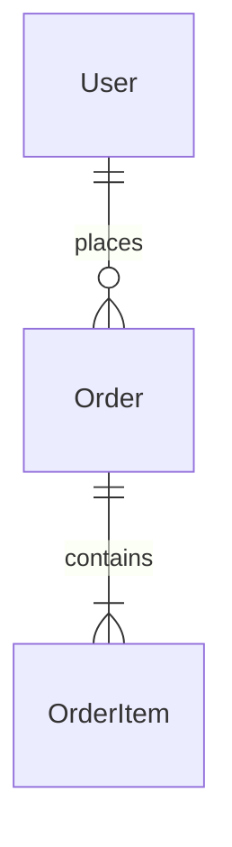
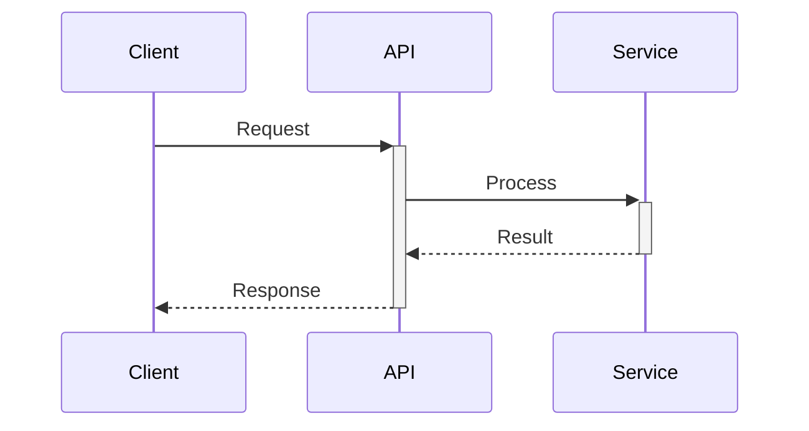

# solution.md format

The solution says how the system is built, using only technology the constitution allows, and must cover every functional requirement. Older bundles name this file `design.md`; the platform type is `solution` either way.

## Skeleton

Sections marked `[optional]` may be omitted when they do not apply. Do not pad with placeholders.

```markdown
# System Solution: [Project Name]

## Overview
### Description
1-3 paragraphs: what is being built, the architectural style, which FRs it covers at a high level.
### Technology Stack
| Component | Technology | Rationale |   <!-- at most 8 rows -->
### Design Decisions Summary
| Decision | Choice | Rationale |     <!-- top-level only, at most 6 rows -->

## High-Level Architecture Design
### Architecture Description
Bullet list (at most 6 items) of major subsystems and request flow.
### Architecture Diagram
(Mermaid `flowchart`)
### Module Interactions [optional; required when 3+ internal modules]
(Mermaid `sequenceDiagram` of the happy path)

## System Modules
### Module 1: [Name]
**Responsibilities**
**Key Components/Sub-parts** [optional table]
**Key Interfaces** [optional pseudocode]
**Data Models** [optional pseudocode]
**Dependencies**
**Error Handling**
### Module 2: [Name]
...

## Data Model
### Entity-Relationship Diagram
(Mermaid `erDiagram`)
### Entities
Per entity: purpose, key fields and types, relationships, indexes and constraints.

## API / Protocol Design
Only the subsections that apply: REST Endpoints / Messaging Subjects / WebSocket Messages / Message Schemas [pseudocode] / Error Codes [required when the API defines its own codes].

## Security Architecture
### Authentication & Authorization
### Input Validation
### Data Protection

## Deployment & Operations
### Infrastructure Layout
### Scaling Strategy
### Configuration
(env var table; only variables that materially affect behaviour)

## Observability [optional but recommended]
### Correlation / Tracing
### Structured Logging
### Metrics & Alerts [optional]

## Testing Strategy [optional]
- Scope per phase; frameworks per layer (unit / integration / e2e).

## Success Criteria
| Criterion | Target | Measurement |   <!-- every measurable NFR maps to a row -->

## Key Solution Decisions
| Decision | Rationale | Alternatives Considered |
```

## Rules

- Use only technologies approved by the constitution.
- Every FR must have a corresponding solution; every measurable NFR maps to a Success Criteria row.
- Decisions include rationale and alternatives considered.
- Scale the document to the project. Repeat per-module sections as `### Module N: Name`; never nest deeper than `####`.
- Pseudocode in language-neutral ` ```text ` fences.
- Mermaid diagrams are mandatory: `flowchart` for architecture, `erDiagram` for the data model, `sequenceDiagram` for module interactions when there are three or more modules; `stateDiagram-v2` optionally for lifecycles. Wrap labels containing spaces, parentheses, or non-ASCII characters in double quotes.
- No metadata footers. Reflect the user's explicit choices; do not override them.

## Mermaid starters







Optional organisation-level addition: C4 System Context and Container diagrams inside High-Level Architecture Design, right after the Architecture Diagram. Only add them when asked.
